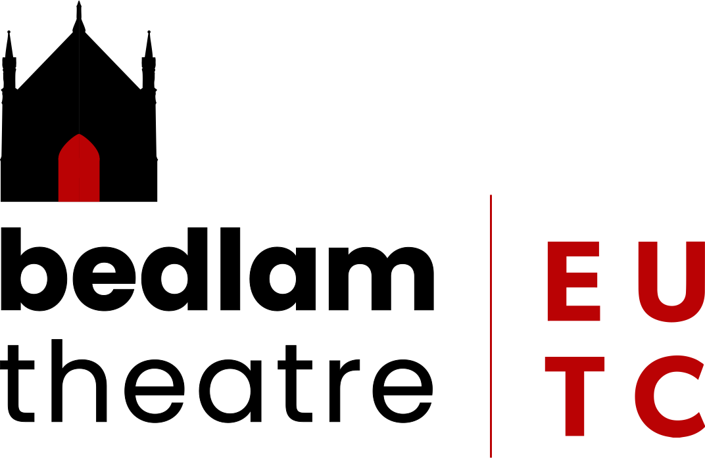

# Branding Guidelines DRAFT NOT YET APPROVED
{: .no_toc }

This version adopted 31.03.2021

  

    Table of contents
  

  {: .text-delta }
1. TOC
{:toc}

## General information

**ALL** posters and publicity of your show must both have the Bedlam Theatre and EUTC Logos.

You can use this guide to easily pick the correct logo to use.

You should not modify the logos without permission, and they should only be used for things directly related to Bedlam Theatre and/or the EUTC.

In order of preference, you should use:

1. The base multiline logo with dark text
2. Then light text
3. Then the single line version with dark text (aka lateral)
4. Then light text

The multiline version with dark text, usually shown on a light background, is the official logo of both Bedlam Theatre (the building) and the EUTC (the society):

An example of the single line version.

## Pick a logo 

You can keep reading or use the Table of Contents to more easily select your logo. Follow it as a step-by-step reference.

### For an EUTC show that takes place in Bedlam

Use the combined Bedlam Theatre/EUTC logo in any colour scheme, in either the multiline or single line version. Examples are above.

### For a non-EUTC show that takes place in Bedlam

Use the combined Bedlam Theatre logo without the EUTC mark in any colour scheme, in either the multiline or single line version.

or alternatively the single line version:

### For an EUTC show that **does not** take place in Bedlam

You can absolutely use the standard logos with Bedlam Theatre in them, and in any case must show the EUTC logo. If you think this might cause confusion, the [Marketing Manager](mailto:marketing@bedlamtheatre.co.uk) can provide you with permission to use the EUTC logo by itself.

## How to use the logo

Firstly, ensure you have a good level of contrast. We recommend that you do this via the [WebAim Contrast Checker](https://webaim.org/resources/contrastchecker/).  It should *at least* pass WCAG AAA for large text but should ideally pass all of them.

To achieve this **recolour your background** and not the logo itself. That said, we have versions for darker backgrounds, and red backgrounds. For the version for red backgrounds, we recommend you use Bedlam Red ([#ba0204](https://www.google.com/search?client=safari&rls=en&q=%23ba0204&ie=UTF-8&oe=UTF-8)).

You should pad (i.e. leave space) around the logo, by at least half the width of the Theatre icon on the horizontal axis, and at least half the height of the Theatre icon on the vertical axis. Basically *give it some room to breathe*.

It has been designed to easily intergrate into your existing designs, and so you generally shouldn't have to put it on a particular background. If you do need to place the logo on a contrasting background, this background **must** always be white, and you **must** use the dark text version. You can use a page peel effect or something along those lines.

The multiline version looks best when placed on the left of your design, if placing on the right consider using the single line version.

## Credits

The logo was designed in 2020 by Alexander Mohan Morzeria-Davis, and finalised in 2021. It was approved by the company on the 22nd of September 2021 at a general meeting, in a motion proposed by him and Lewis Forman (the marketing manager).